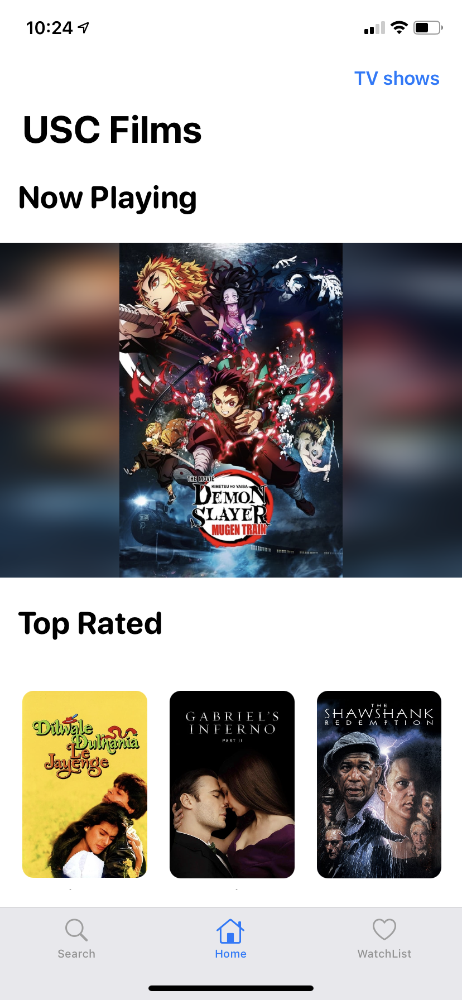

# TMDB Netfilx Like Website

##  Overview

In this project, I built a TMDB iOS app for user to not only find their favorite movies but also share the movies to their friends. User can get all the information for the movies and even watch the trailer here with their iPhone or even iPad.

## HomePage

The Home page of this app with a movie section and a tv show section.

  

There is a carousel on the top and two horizontal scroll views with 20 cards.

  

## Horizontal ScrollView with Contextmenu

Movie and TV Shows show in the horizontalscroll form.
If a card is being add to watchlis, the bookmark will be filled, else it will be empty.

There are a share to facebook button and share to twitter button, after clicking those button, it will redirect user to their social media

## Watchlist

User can add any show to their watchlist.
Also they can remove it by long press the card or even drap and drop the card for their preference order

## Search

A search bar for quick access to any type of media.

## Detail Section 

Detail for any shows on the website including casts, reviews and recommend show.
The button on the toolbar has the same function as the homepage.

## Show Review Details

After pressing card of review, it will show more content.

